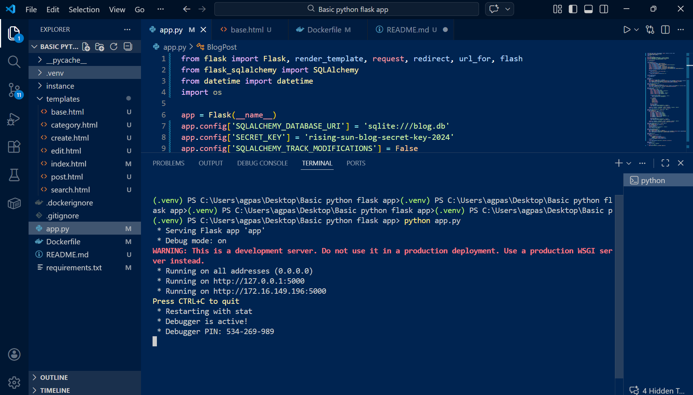
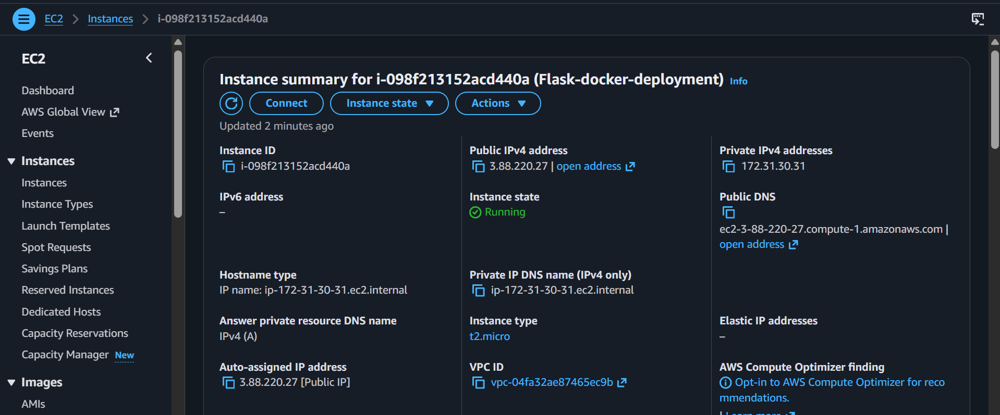
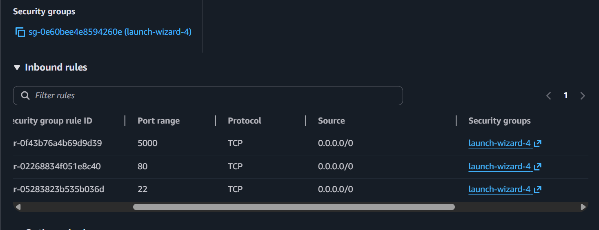
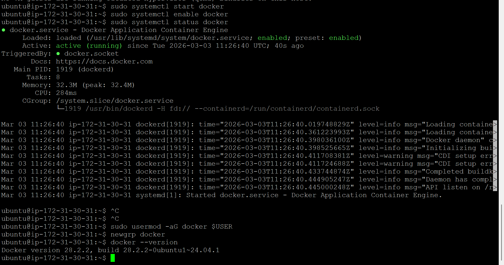
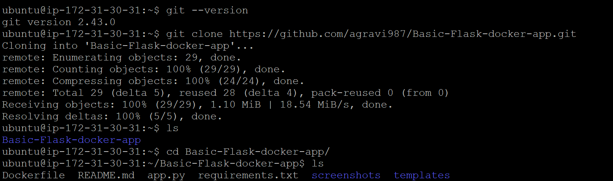
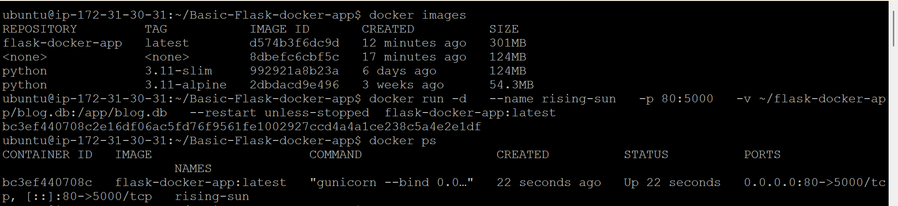
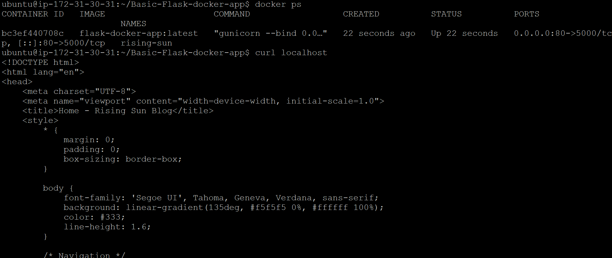
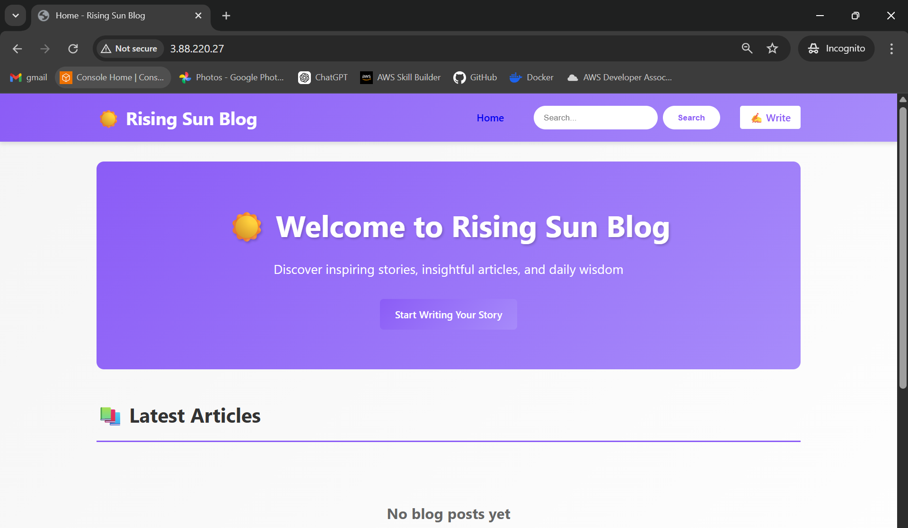

# EC2 + PuTTY Deployment Guide — Rising Sun Blog App

This file contains a complete, copyable deployment guide to containerize and run the Rising Sun Blog App on an Ubuntu EC2 instance using PuTTY from Windows.

## Prerequisites

- AWS account with permissions to create EC2 instances and security groups
- EC2 key pair (.pem) downloaded to your Windows machine
- (Optional) Docker Hub account if you want to push/pull images

## 1) Build locally (optional)

```bash
cd "c:\Users\agpas\Desktop\Basic python flask app"
docker build -t rising-sun-blog:latest .
# test locally
docker run --rm -p 5000:5000 rising-sun-blog:latest
```



## 2) (Optional) Push to Docker Hub

```bash
docker tag rising-sun-blog:latest YOUR_DOCKERHUB_USERNAME/rising-sun-blog:latest
docker login
docker push YOUR_DOCKERHUB_USERNAME/rising-sun-blog:latest
```

## 3) Launch EC2 (Ubuntu 22.04 LTS)

- Instance type: `t2.micro` (or appropriate)
- Key pair: `your-key.pem` (downloaded)
- Security group inbound rules:
  - SSH (TCP 22) from your IP
  - HTTP (TCP 80) from 0.0.0.0/0 (or restrict as you prefer)
  - (Optional) TCP 5000 if you want direct Flask port access




Note the instance Public IP.

## 4) Convert `.pem` to `.ppk` for PuTTY (Windows)

1. Open PuTTYgen (part of PuTTY).
2. Click **Load**, select `your-key.pem` (choose "All Files").
3. Click **Save private key** → save as `your-key.ppk`.

## 5) Connect via PuTTY

- PuTTY → Host Name: `ubuntu@<PUBLIC_IP>`
- Connection → SSH → Auth → Private key file: choose `your-key.ppk`
- Open and login as `ubuntu`.

Alternative (PowerShell OpenSSH):

```powershell
ssh -i C:\path\to\your-key.pem ubuntu@<PUBLIC_IP>
```

## 6) Install Docker on EC2

```bash
sudo apt update
sudo apt install -y docker.io
sudo systemctl start docker
sudo systemctl enable docker
sudo usermod -aG docker $USER
newgrp docker
docker --version
```



## 7) Transfer code to EC2

Option A — Git (recommended):

```bash
sudo apt install -y git
git clone <your-github-repo-url> rising-sun-blog
cd rising-sun-blog
```




Option B — SCP/WinSCP from Windows:

PowerShell example:

```powershell
scp -i C:\path\to\your-key.pem -r "C:\Users\agpas\Desktop\Basic python flask app" ubuntu@<PUBLIC_IP>:/home/ubuntu/rising-sun-blog
```

## 8) Build & run on EC2

If pulling from Docker Hub:

```bash
docker pull YOUR_DOCKERHUB_USERNAME/rising-sun-blog:latest
docker run -d --name rising-sun -p 80:5000 --restart unless-stopped YOUR_DOCKERHUB_USERNAME/rising-sun-blog:latest
```

If building on EC2:

```bash
cd ~/rising-sun-blog
docker build -t rising-sun-blog:latest .
mkdir -p ~/rising-sun-data
touch ~/rising-sun-data/blog.db

docker run -d \
  --name rising-sun \
  -p 80:5000 \
  -v ~/rising-sun-data/blog.db:/app/blog.db \
  --restart unless-stopped \
  rising-sun-blog:latest
```


Notes:
- Mapping `~/rising-sun-data/blog.db` to `/app/blog.db` preserves the SQLite DB across container restarts.
- Use `--restart unless-stopped` to auto-start container after reboot.

## 9) Verify & Access

```bash
docker ps
docker logs rising-sun --tail 200
```

From your browser:

```
http://<PUBLIC_IP>
```




## Troubleshooting

- Check Security Group inbound rules (80/22)
- Confirm container is running: `docker ps`
- Confirm host is listening: `sudo ss -tulnp | grep 80`
- Check container logs: `docker logs rising-sun --tail 200`
- Exec into container: `docker exec -it rising-sun /bin/sh`

## Optional: docker-compose

Example `docker-compose.yml`:

```yaml
version: '3.8'
services:
  web:
    image: rising-sun-blog:latest
    build: .
    ports:
      - "80:5000"
    volumes:
      - ./rising-sun-data/blog.db:/app/blog.db
    restart: unless-stopped
```

Run:

```bash
docker-compose up -d --build
```

## Security & Production Notes

- Use NGINX as a reverse proxy and TLS terminator for production.
- Do not hard-code `SECRET_KEY` — use environment variables.
- For scale/production, consider moving to a managed DB (RDS) instead of SQLite.

---

If you'd like, I can add a `docker-compose.yml` or a systemd unit file next.
